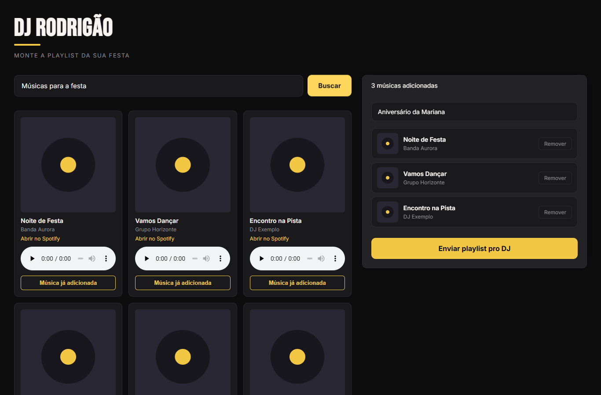
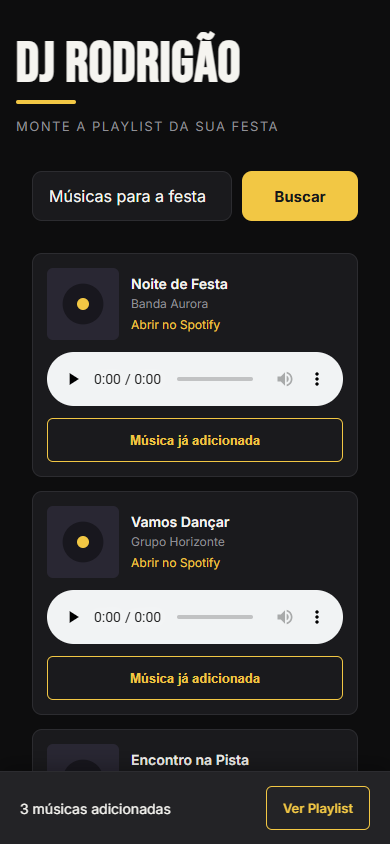

# DJ Rodrigão Playlist

Site para o contratante de um evento pesquisar músicas, montar sua seleção e preparar uma mensagem para o DJ Rodrigão no WhatsApp, sem cadastro ou login.

Projeto destinado ao trabalho real do DJ e ao portfólio do desenvolvedor. A v1 está implementada localmente; a validação em aparelhos físicos e o deploy público ainda estão pendentes.

## Funcionalidades

- Busca por música ou artista no iTunes, com carregamento, validação de campo vazio, nenhum resultado e tratamento de erros.
- Cancelamento de buscas anteriores e limite de espera de 20 segundos.
- Prévias de até 30 segundos, quando disponíveis, com apenas uma tocando por vez.
- Link para pesquisar a música e o artista no Spotify.
- Adição e remoção de músicas, evitando duplicatas pelo `trackId`.
- Nome opcional da festa e salvamento automático no navegador.
- Mensagem numerada para o WhatsApp, confirmada manualmente pelo contratante.
- Barra expansível nas telas menores e playlist ao lado da busca a partir de 1024 px.

## Interface

Capturas da aplicação com músicas e capas de demonstração, sem representar respostas reais do catálogo do iTunes.

### Computador



### Celular



## Executar localmente

Pré-requisitos: Git, Node.js e npm. Validado com Node.js **24.15.0**. Node.js 22 a partir de **22.13.0** também atende aos requisitos declarados pelas versões instaladas de Vite e ESLint.

```bash
git clone https://github.com/gustavoagsilva/dj-rodrigao-playlist.git
cd dj-rodrigao-playlist
npm ci
npm run dev
```

Abra o endereço informado pelo Vite no terminal. Normalmente é `http://localhost:5173`; se a porta estiver ocupada, ele pode selecionar outra.

A implementação atual não exige chave de API ou arquivo `.env`. Busca, capas, prévias e fontes externas dependem de conexão com a internet.

## Comandos

| Comando | Finalidade |
| --- | --- |
| `npm run dev` | Inicia o servidor de desenvolvimento. |
| `npm run lint` | Executa o ESLint. |
| `npm run build` | Gera a versão de produção em `dist/`. |
| `npm run preview` | Serve localmente o build já gerado. Não faz deploy. |

## Tecnologias e estrutura

React 19, JavaScript/JSX, CSS próprio, Vite e ESLint. A v1 não possui backend próprio ou banco de dados remoto.

```text
docs/
  requisitos.md
  imagens/
public/                         # Arquivos públicos, incluindo favicon
src/
  components/
    BuscaMusica/                # Requisições, estados da busca e controle de áudio
    CardMusica/                 # Resultado com capa, prévia e ações
    MinhaPlaylist/              # Nome da festa, seleção e painel responsivo
    BotaoEnviarWhatsApp/        # Mensagem formatada e link de envio
  styles/variables.css          # Paleta, fontes e arredondamentos
  App.jsx                       # Estado da festa e persistência
  App.css                       # Layout principal
  main.jsx                      # Inicialização do React
  index.css                     # Estilos globais
```

Cada pasta de componente contém seu JSX e CSS. O destinatário está na constante `WHATSAPP_NUMBER` em [BotaoEnviarWhatsApp.jsx](src/components/BotaoEnviarWhatsApp/BotaoEnviarWhatsApp.jsx), no formato internacional com código do país e DDD, somente dígitos.

## Persistência e envio

O `App` salva `{ playlist, name }` na chave `dj-rodrigao:festa` do `localStorage`. A recuperação depende do mesmo navegador/perfil e da mesma origem do site (protocolo, domínio e porta). Limpar os dados do site remove a seleção local. Não há sincronização automática entre aparelhos ou abas abertas.

O botão do WhatsApp abre uma mensagem preparada, sem enviar automaticamente e sem apagar a playlist. O nome da festa só entra quando preenchido. O botão fica desabilitado com a seleção vazia.

## Validação e próximos passos

- Lint e build executados com sucesso.
- Testes locais no Edge cobriram busca, áudio, persistência, mensagem do WhatsApp e diferentes larguras/alturas.
- Os testes usaram respostas simuladas, áudio de teste e interceptação do WhatsApp; nenhuma mensagem foi enviada. Os scripts estão fora do repositório, e não há comando `npm test` configurado.
- Falta validar o fluxo com serviços reais, Chrome/Android e Safari/iPhone, incluindo teclado virtual, e publicar uma URL estável.
- Prévias dependem do catálogo. Falhas no salvamento local são capturadas e registradas no console, mas ainda não aparecem em um aviso na interface.
- “Continuar em outro aparelho” ficou para uma versão futura, com armazenamento online e link exclusivo da festa.

Consulte os [requisitos, decisões e pendências da v1](docs/requisitos.md).
